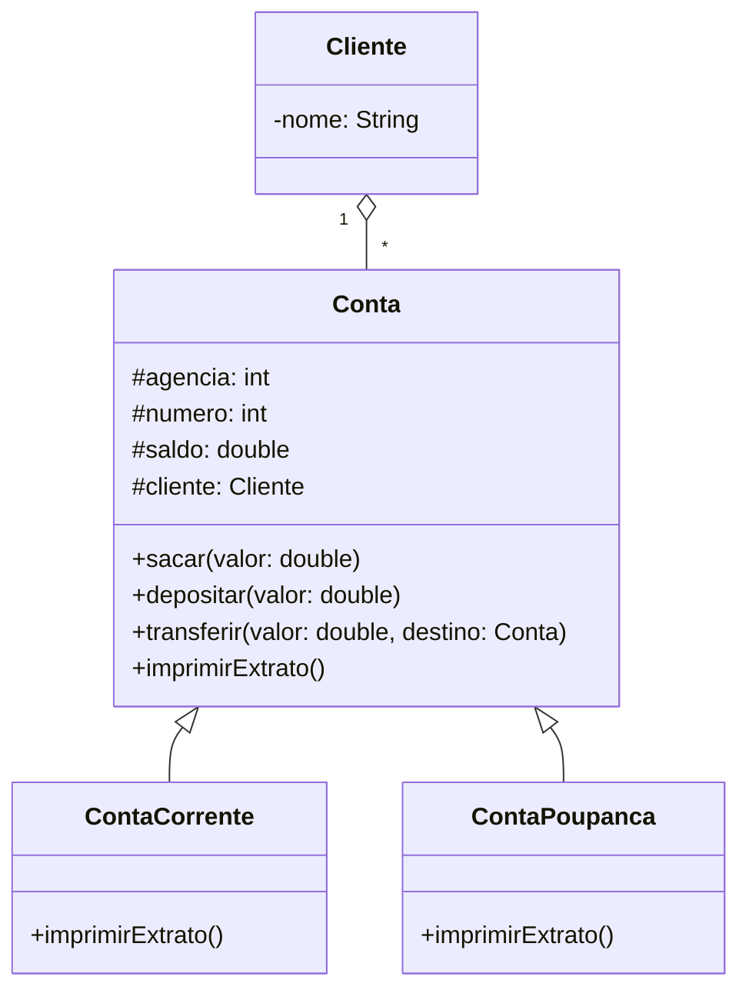

# Banco Digital Java - Bootcamp Santander DIO 🚀

[](https://www.oracle.com/java/technologies/javase/jdk17-archive-downloads.html)
[](https://maven.apache.org/)

Bem-vindo ao projeto **Banco Digital Java**, desenvolvido como parte do Bootcamp Santander Java da [Digital Innovation One (DIO)](https://www.dio.me/). Este repositório implementa um banco digital simples, explorando e aplicando todos os pilares da Programação Orientada a Objetos (POO) em Java, com um menu completo para operações bancárias entre contas!

## ✨ Sobre o Projeto

O desafio consiste em criar um sistema bancário que permita ao usuário:

- Criar clientes e contas (corrente e poupança)
- Realizar depósitos, saques e transferências entre contas do próprio banco

Tudo isso utilizando os conceitos fundamentais de POO: **Abstração, Encapsulamento, Herança e Polimorfismo**.

> **Enunciado original:** Confira o laboratório oficial deste projeto [neste repositório](https://github.com/falvojr/lab-banco-digital-oo).

---

## 📚 Estrutura do Projeto




## 🧑‍💻 Princípios de POO Aplicados

- Abstração: Modelagem das entidades do domínio bancário (Cliente, Conta, etc.) de forma clara e objetiva.
- Encapsulamento: Atributos protegidos e acesso controlado por métodos, garantindo a integridade dos dados.
- Herança: ContaCorrente e ContaPoupanca herdam os atributos e métodos comuns da classe Conta.
- Polimorfismo: Métodos sobrescritos e possibilidade de manipular contas de maneira genérica.
  
## 🚀 Como Executar

Pré-requisitos:

- Java 17+
- Maven 3.8.1+
- Clone o repositório:

```bash
git clone https://github.com/Tavaressan/banco-digital-java-dio-santander.git
cd banco-digital-java-dio-santander
```

### Compile e execute o projeto:

```bash
mvn clean compile
mvn exec:java -Dexec.mainClass="seu.pacote.Main"
```

### Substitua seu.pacote.Main pelo caminho correto do seu arquivo principal, caso necessário.

## 📋 Exemplos de Uso
- Criar conta para um cliente
- Depositar: Informe o valor e escolha a conta desejada.
- Sacar: Realize saques respeitando o saldo disponível.
- Transferir: Faça transferências entre contas correntes e/ou poupança do banco.
- Todas as operações podem ser simuladas via menu interativo no terminal!

## 🤝 Contribua!
Contribuições são muito bem-vindas! Sinta-se à vontade para abrir issues, propor melhorias ou enviar pull requests. Consulte as diretrizes de contribuição caso existam.

## 🏆 Créditos
Projeto desenvolvido durante o Bootcamp Santander Java da DIO

Enunciado original: [falvojr/lab-banco-digital-oo]((https://github.com/falvojr/lab-banco-digital-oo).)

Implementação: Tavaressan

## ⚖️ Licença
Uso livre para fins educacionais e demonstração em portfólios de GitHub.
Este projeto não possui licença específica.

### Bom código e bons estudos! 💻
